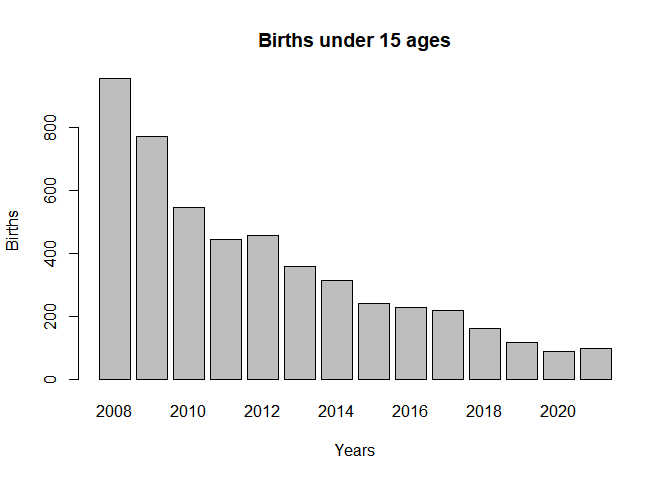
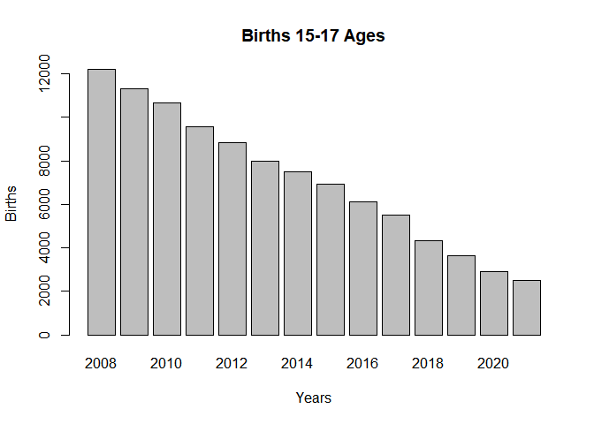
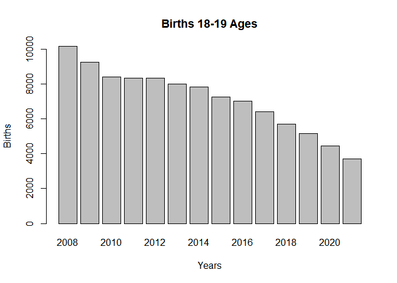
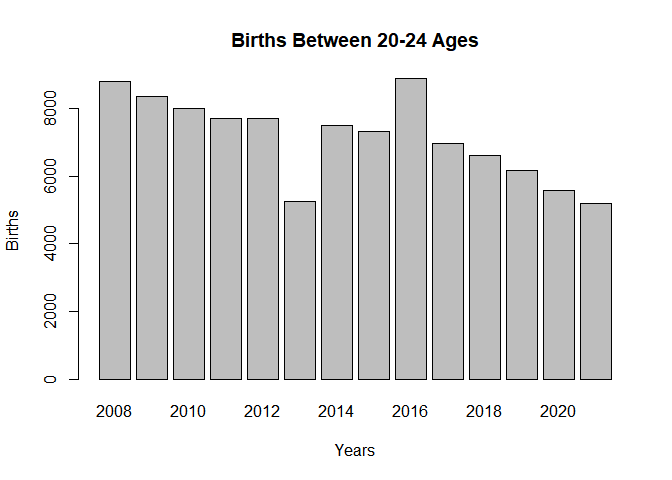
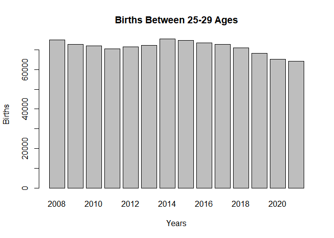
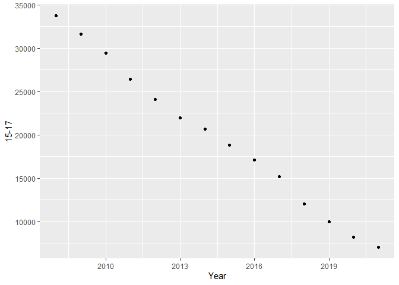
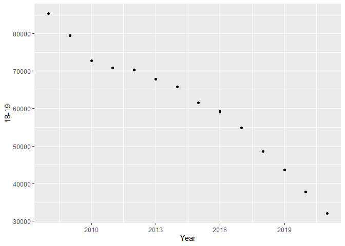

Birth Age of Woman in Turkey
================
Yaren Öcal
(15 December, 2022)

- <a href="#introduction" id="toc-introduction">Introduction</a>
- <a href="#method" id="toc-method">Method</a>
- <a href="#resuts" id="toc-resuts">Resuts</a>
  - <a href="#statictical-result" id="toc-statictical-result">Statictical
    Result</a>
- <a href="#general-discussion" id="toc-general-discussion">General
  Discussion</a>
- <a href="#further-information" id="toc-further-information">Further
  Information</a>
- <a href="#references" id="toc-references">References</a>

## Introduction

In this study, I will compare the fertility ages of women living in
Turkey according to the years **2008-2021**. My main purpose here is to
examine the effect of increasing the rate of education and the fact that
women are more in education and business life on the age of giving
birth. The question I focus on in this study; What effect does education
level have on women’s age at birth? I argue that the increase in the
level of education and the participation of more women in business life
delay the birth age of women living in Turkey.

In this study, I will especially focus on mothers under the age of 20.
Generally, pregnancies under the age of 20 are considered adolescent
pregnancies (Selma and Kavlak 2011). But in order to make comparisons, I
included *20-24* years old and *25-29* years old in my study.

My previous research was examined as two different subjects. (BAYTUN
2013)and (ÖZAYDINLIK 2014) focused on female literacy in Turkey. (Selma
and Kavlak 2011; YILMAZ and AVCI 2015; Burcu et al. 2015) j worked on
child marriage and births. My research covers all these studies.

## Method

This study compares the previous data of the Turkish Statistical
Institute. For this, two separate data sets were used.

- Data set:

1)  Gender and educational background
2)  Women’s ages and births

These two data were analyzed comparatively.

``` r
library(readxl)
Education_by_gender <- read_excel("C:/Users/win11/Desktop/Data science/Education by gender.xls")
View(Education_by_gender)
```

``` r
library(readxl)
Births_by_mother_s_age <- read_excel("C:/Users/win11/Desktop/Data science/Births by mother's age.xlsx")
View(Births_by_mother_s_age)
```

## Resuts

``` r
plot(Education_by_gender, type= "l", main = "Education Rate")
```

<!-- -->

In the chart above, the reading rates of women are given. From 2008 to
2021, female literacy rates have been steadily increasing. In fact, in
2021, this rate has approached almost 100%. In the continuation of the
study, I will examine the age groups one by one. The reason for this is
to be able to clearly show the changes in the groups. For this study, I
divided my age groups into five different groups.

1.  under 15 ages
2.  15-17 ages
3.  18-19
4.  20-24
5.  25-29

``` r
barplot(table(sample(2008:2021, size = 5000, replace = TRUE, prob = c(1261,956,716,583,568,449,436,321,309,280,198,157,119,117))), xlab = "Years", ylab = "Births", main = "Births under 15 ages")
```

<!-- -->

The first group I will examine is those who are mothers under the age of
15. Individuals in this group are called adolescent pregnancy. As you
can see in the graph, it has decreased considerably from 2008 compared
to 2021 snake. Especially since 2018, quite a few women became mothers
at a young age.

``` r
barplot(table(sample(2008:2021, size =  100000, replace = TRUE, prob = c(33719,31596,29449,26420,24098,21967,20682,18841,17092,15189,12037,9981,8185,7073))), xlab = "Years", ylab = "Births", main = "Births 15-17 Ages")
```

<!-- -->

The second group I will examine is those who are mothers at the age of
15-17. Individuals in this group are also called adolescent pregnancy.
As you can see in the graph, the rates decreased from 2008 to 2021
snakes. However, this decline is not as sharp as the first group, under
the age of 15.

``` r
barplot(table(sample(2008:2021, size = 100000, replace = TRUE, prob = c(85329,79520,72735,70877,70299,67847,65860,61559,59244,54825,48598,43659,37776,32091))), xlab = "Years", ylab = "Births", main = "Births 18-19 Ages")
```

<!-- -->

The other group I will examine are those who are 18-19 years old
mothers. Individuals in this group are also called adolescent pregnancy.
As you can see in the graph, the rates decreased from 2008 to 2021
snakes. However, the decrease in these numbers is unfortunately not
significant. Because those are still too high.

``` r
barplot(table(sample(2008:2021, size = 100000, replace = TRUE, prob = c(375728,358462,344108,334735,332232,232274,327116,315594,390470,302766,285286,263303,245913,229359))), xlab = "Years", ylab = "Births", main = "Births Between 20-24 Ages")
```

<!-- -->

I used the next two age groups for comparison purposes only. Individuals
in these groups are not counted as adolescent births. When we look at
the chart, we see fluctuations. Specifically, we cannot say that births
have increased or decreased from 2008 to 2021.

``` r
barplot(table(sample(2008:2021, size = 1000000, replace = TRUE, prob = c(414075,401079,396887,389397,397945,400292,416737,414956,406808,403657,392701,377338,358542,353824))), xlab = "Years", ylab = "Births", main = "Births Between 25-29 Ages")
```

<!-- -->

There are also fluctuations in this chart. However, we can say that the
general birth rate decreased after 2014. It is not possible to associate
this decrease with education, as I have claimed. The main reason for
this is that, according to the Turkish Statistics Committee, 50.8% of
women have joined the workforce since these years.

### Statictical Result

``` r
str(Births_by_mother_s_age)
```

    ## tibble [14 × 6] (S3: tbl_df/tbl/data.frame)
    ##  $ Year : num [1:14] 2008 2009 2010 2011 2012 ...
    ##  $ <15  : num [1:14] 1261 956 716 583 568 ...
    ##  $ 15-17: num [1:14] 33719 31596 29449 26420 24098 ...
    ##  $ 18-19: num [1:14] 85329 79520 72735 70877 70299 ...
    ##  $ 20-24: num [1:14] 375728 358462 344108 334735 332232 ...
    ##  $ 25-29: num [1:14] 414075 401079 396887 389397 397945 ...

``` r
summary(Births_by_mother_s_age)
```

    ##       Year           <15             15-17           18-19      
    ##  Min.   :2008   Min.   : 117.0   Min.   : 7073   Min.   :32091  
    ##  1st Qu.:2011   1st Qu.: 218.5   1st Qu.:12825   1st Qu.:50155  
    ##  Median :2014   Median : 378.5   Median :19762   Median :63710  
    ##  Mean   :2014   Mean   : 462.1   Mean   :19738   Mean   :60730  
    ##  3rd Qu.:2018   3rd Qu.: 579.2   3rd Qu.:25840   3rd Qu.:70733  
    ##  Max.   :2021   Max.   :1261.0   Max.   :33719   Max.   :85329  
    ##      20-24            25-29       
    ##  Min.   :229359   Min.   :353824  
    ##  1st Qu.:289656   1st Qu.:390223  
    ##  Median :319434   Median :399119  
    ##  Mean   :310525   Mean   :394588  
    ##  3rd Qu.:334109   3rd Qu.:406020  
    ##  Max.   :375728   Max.   :416737

``` r
data1 <- as.numeric(unlist(Births_by_mother_s_age))
```

``` r
summary(Births_by_mother_s_age$`<15`)
```

    ##    Min. 1st Qu.  Median    Mean 3rd Qu.    Max. 
    ##   117.0   218.5   378.5   462.1   579.2  1261.0

``` r
sd(Births_by_mother_s_age$`<15`)
```

    ## [1] 333.9143

As you can see, the average of women who are mothers under the age of 15
is 462.1 and standard deviation is 333.9143.

``` r
summary(Births_by_mother_s_age$`15-17`)
```

    ##    Min. 1st Qu.  Median    Mean 3rd Qu.    Max. 
    ##    7073   12825   19762   19738   25840   33719

``` r
sd(Births_by_mother_s_age$`15-17`)
```

    ## [1] 8667.992

As you can see, the average of women who are mothers age between 15 and
17 is 19738 and standard deviation is 8667.992.

``` r
summary(Births_by_mother_s_age$`18-19`)
```

    ##    Min. 1st Qu.  Median    Mean 3rd Qu.    Max. 
    ##   32091   50155   63710   60730   70733   85329

``` r
sd(Births_by_mother_s_age$`18-19`)
```

    ## [1] 15682.52

As you can see, the average of women who are mothers age between 18 and
19 is 63710 and standard deviation is 15682.52.

## General Discussion

``` r
library(ggplot2)
```

``` r
ggplot(data=Education_by_gender, aes(x = `Rate%`, y = `Year`), x= "Year", y= "Rate%") +
  geom_point()
```

<!-- -->

``` r
ggplot(Births_by_mother_s_age, aes(x = `Year`, y = `<15`), xlab = "Births", ylab = "Years") +
  geom_point()
```

<!-- -->

``` r
ggplot(Births_by_mother_s_age, aes(x = `Year`, y = `15-17`), xlab = "Births", ylab = "Years") +
  geom_point()
```

<!-- -->

``` r
ggplot(Births_by_mother_s_age, aes(x = `Year`, y = `18-19`), xlab = "Births", ylab = "Years") +
  geom_point()
```

<!-- -->

As I claim, given the above rates, the level of education has increased
significantly over the years. This shows that women are more involved in
education. On the other hand, there is a decrease in birth rates
especially in adolescent gestational ages (under 15 – under 20 years
old). In the distribution tables I have given above, we see more clearly
that the number of births has decreased. One of the main reasons for
this can be shown as the increase in education level. Apart from this,
birth rates have decreased due to women’s participation in the labor
force, especially at the age of 25-29.

When analyzed statistically, especially the number of adolescent
pregnancies is high. However, when the minimum and maximum values are
compared, a decrease in these numbers is observed. As a result, as I
claimed, the increasing education rate since 2008 has reduced the rate
of having a baby at a young age.

## Further Information


Many institutions like these two institutions are working for the
education of children today. Its main objectives are to complete the
education of all children living in Turkey and to ensure equality
between men and women in the field of education.

## References

<div id="refs" class="references csl-bib-body hanging-indent">

<div id="ref-baytun2013turkiye" class="csl-entry">

BAYTUN, İnci Duygu. 2013. “TÜRKİYE’DE DEMOGRAFİk VERİLER ÜZERİNDEN
OKUMA-YAZMA ORANLARININ cİNSİYET BAZINDA DEĞERLENDİrİLMESİ.”
*International Journal of New Trends in Arts, Sports & Science Education
(IJTASE)* 2 (3).

</div>

<div id="ref-burcu2015ccicceklerin" class="csl-entry">

Burcu, Esra, Filiz Yıldırım, Çiğdem Sema Sırma, and Seçil Sanıyaman.
2015. “Çiçeklerin Kaderi: Türkiye’de Kadınların Erken Evliliği <span
class="nocase">ü</span>zerine Nitel Bir Araştırma.” *Bilig*, no. 73:
63–98.

</div>

<div id="ref-ozaydinlik2014toplumsal" class="csl-entry">

ÖZAYDINLIK, Kevser. 2014. “Toplumsal Cinsiyet Temelinde türkiye’de Kadın
Ve eğitim.” *Sosyal Politika Çalışmaları Dergisi*, no. 33.

</div>

<div id="ref-selma2011ccocuk" class="csl-entry">

Selma, ŞEN, and Oya Kavlak. 2011. “Çocuk Gelinler: Erken Yaş Evlilikleri
Ve Adölesan Gebeliklere Yaklaşım.” *Sosyal Politika Çalışmaları Dergisi*
25 (25): 35–44.

</div>

<div id="ref-yilmaz201515" class="csl-entry">

YILMAZ, Ayten, and İlknur Aydın AVCI. 2015. “15-49 Yaş Grubu Evli
Kadınların Bazı Toplumsal Cinsiyet <span
class="nocase">ö</span>zellikleri Ile Evlilik Uyumları Arasındaki
Ilişki.” *Gümüşhane Üniversitesi Sağlık Bilimleri Dergisi* 4 (2):
180–93.

</div>

</div>
